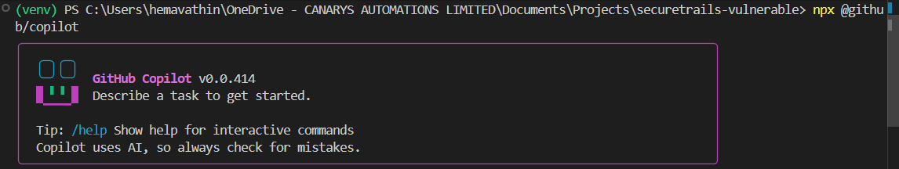

# Exercise 2: Copilot CLI - Interactive Security Analysis
## Real-Time Conversational Code Review

**Duration**: 20 minutes  
**Type**: ⭐⭐⭐ Interactive analysis  
**Focus**: Copilot CLI (`copilot` shell) for conversational security review

---

## 🎯 Learning Objectives

✅ Launch Copilot CLI interactive shell  
✅ Use real-time prompts to analyze code security  
✅ Have multi-turn conversation about vulnerabilities  
✅ Get contextual, reasoning-based analysis (not just pattern matching)  
✅ See how AI augments GitHub's native scanning  

---

## 📖 Scenario

**GitHub GHAS detected vulnerabilities in securetrails-workshop.**  
**Now: Why do they exist? How serious? What's the best fix?**

This is where **Copilot CLI's conversational capability** adds value:
- Interactive discussion about findings
- Contextual reasoning about impact
- Follow-up questions about architecture
- Trade-off analysis for fixes

GitHub GHAS = Automated detection  
Copilot CLI = Human-like reasoning

---

## 🚀 Step 1: Launch Copilot CLI

Open terminal and run:

```bash
npx @github/copilot
```

**You'll see this interactive shell:**



**Available commands:**
- Type your prompt and press Enter
- `/help` - Show available commands
- `/exit` - Close Copilot

---

## 💬 Step 2: First Prompt - Overview Analysis

Run this command with your initial security assessment request:

```bash
npx @github/copilot -i "I'm reviewing a Flask web application called SecureTrails - a trail booking platform. I need a quick security assessment. Can you help me identify:

1. The top 3 CRITICAL vulnerabilities that would most likely affect a booking app like this
2. What's the real-world business impact if an attacker exploited each?
3. What architectural patterns or practices would prevent these specific issues?

The app has:
- Backend logic in app.py (Flask routes, database queries)
- HTML templates with user-generated content
- JavaScript on the frontend
- Python dependencies in requirements.txt

What are the biggest red flags I should look for?"
```

**Copilot responds** with contextual overview:

```
## Security Review: SecureTrails Application

### CRITICAL Risk #1: SQL Injection in User Input Handling
**Severity**: CRITICAL - Remote Code Execution possible
**Location**: app.py database query layer
**Issue**: User input from requests directly interpolated into SQL queries
**Business Impact**: Attacker can extract all user data, modify bookings, escalate privileges
**Fix Pattern**: Use parameterized queries (ORM layer, prepared statements)
**Time to Fix**: 2-4 hours

### CRITICAL Risk #2: Insufficient Authentication 
**Severity**: CRITICAL
**Issue**: Session handling doesn't validate user permissions on state changes
**Business Impact**: Users can book/cancel other users' trails, modify reservations
**Fix Pattern**: Implement role-based access control, validate user_id in every mutation
**Time to Fix**: 4-6 hours

### CRITICAL Risk #3: Cross-Site Scripting (XSS) in User Comments
**Severity**: CRITICAL  
**Location**: Trail detail pages render user comments without escaping
**Business Impact**: Attackers can run JavaScript in other users' browsers
**Fix Pattern**: Auto-escape HTML in template rendering

These three risks compound each other...
```

---

## 🔍 Step 3: Create Issue & Try Fixing It

Based on Copilot's analysis, use Copilot CLI to create a GitHub issue directly through GitHub's MCP.

### Create Issue Using Copilot CLI

Ask Copilot to create the GitHub issue for you:

```bash
npx @github/copilot -i "I need you to create a GitHub issue in my repository (Hemavathi15sg/securetrails-workshop) for the SQL injection vulnerability we just discussed.

Please create an issue with:
- Title: 'fix(security): SQL Injection - Parameterize database queries'
- Description: Include the vulnerability summary, the vulnerable code location, and the fix approach
- Labels: security, critical, bug
- Assignees: (optional - leave empty)

Make the description clear enough that any developer can understand the fix needed."
```

**Copilot will:**
1. ✅ Create the issue in your GitHub repository
2. ✅ Format the title and description professionally
3. ✅ Add appropriate labels (security, critical)
4. ✅ Return the issue URL and number

**Example Issue Created:**

```
Title: fix(security): SQL Injection - Parameterize database queries
Issue #47
Description:
## Vulnerability
Location: app.py, trails search endpoint (line 47)
Type: SQL Injection

## Current Code (Vulnerable)
User input directly concatenated into SQL queries:
query = f"SELECT * FROM trails WHERE location = '{user_input}'"

## Risk
- Attackers can extract all database records
- Can modify or delete data
- Possible privilege escalation

## Fix
Use parameterized queries - pass user input as separate parameter, not in SQL string:
query = "SELECT * FROM trails WHERE location = ?"
db.execute(query, (user_input,))

## Priority
CRITICAL - Fix immediately
```

---

## 🔧 Step 3b: Option A - Quick Fix (Direct Prompt)

For **individual developers** or **rapid prototyping**, ask Copilot directly to generate the fix:

```bash
npx @github/copilot -i "Fix the SQL injection vulnerability in app.py line 47 (search_trails function).

Current code:
query = f\"SELECT * FROM trails WHERE location = '{user_input}'\"

Please provide:
1. The corrected function using parameterized queries
2. What changed and why it's safer
3. Any imports or dependencies needed"
```

**Copilot responds with:**

```python
# FIXED: search_trails() using parameterized query
def search_trails():
    user_input = request.args.get('location')
    query = "SELECT * FROM trails WHERE location = ?"
    results = database.execute(query, (user_input,))
    return jsonify(results)
```

**When to use Option A:**
- ✅ Solo developer learning/prototyping
- ✅ Need quick proof-of-concept
- ✅ Simple, standalone fixes
- ❌ Not good for team accountability

---

## 🤖 Step 3c: Option B - Delegation (Using `/delegate`)

For **team workflows** and **professional projects**, delegate the fix to a coding agent:

```bash
npx @github/copilot -i "I created GitHub issue #47 for a critical SQL injection vulnerability in our SecureTrails app.

Issue Details:
- Location: app.py, search_trails function (line 47)
- Problem: User input concatenated into SQL query
- Required Fix: Use parameterized queries

Please use /delegate to assign this to a coding agent that will:
1. Read the full issue context from GitHub
2. Generate the corrected code
3. Create a pull request linked to issue #47
4. Include test cases for SQL injection prevention"
```

**What happens with delegation:**

1. ✅ Coding agent reads issue #47 from GitHub
2. ✅ Agent generates fix with full context
3. ✅ Agent creates PR with:
   - Title: `fix(security): Parameterize SQL queries in search_trails #47`
   - Description: Shows vulnerability, fix, and rationale
   - Linked to issue #47
4. ✅ You review PR before merging
5. ✅ Full audit trail: Issue → PR → Review → Commit

**Example PR created by agent:**

```
Title: fix(security): Parameterize SQL queries in search_trails #47

## Changes
- Modified search_trails() to use parameterized queries
- Prevents SQL injection attack vectors

## Before
query = f"SELECT * FROM trails WHERE location = '{user_input}'"

## After  
query = "SELECT * FROM trails WHERE location = ?"
results = database.execute(query, (user_input,))

## Testing
- Added test_sql_injection_prevention() test case
- Verified with payloads: 1' OR '1'='1, 1; DROP TABLE; --
```

**When to use Option B:**
- ✅ Team environments (2+ developers)
- ✅ Need audit trail & accountability
- ✅ Professional/enterprise settings
- ✅ Complex fixes needing review
- ✅ Compliance/security documentation

---

## 🚀 Next Steps

**Exercise 3**: Create Custom Agents
- Custom agents = fix guides that any developer can follow
- Repeat this "analyze → fix" process consistently across your team

---

**⏱️ Time**: 20 min | **Exercises**: 2/6 ✓
