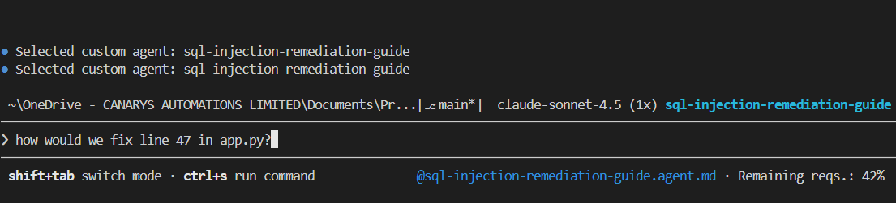

# Exercise 3: Create Custom Agents Using Copilot CLI
## Using Built-in Agent Management System

**Duration**: 20 minutes  
**Type**: ⭐⭐⭐⭐ Agent creation  
**Focus**: Use Copilot CLI's `/agents` system to create custom agents

---

## 🎯 Learning Objectives

✅ Launch Copilot CLI and access the Agent menu  
✅ Use Copilot CLI's built-in `/agents` management  
✅ Create domain-specific agents for vulnerabilities  
✅ Understand agent structure and documentation  
✅ Build a library of custom agents for SecureTrails  

---

## 📖 What is a Custom Agent?

**In Copilot CLI, a "Custom Agent" is:**
- A reusable instruction set for fixing specific vulnerabilities
- Managed through Copilot CLI's interactive menu
- Can be invoked to guide developers through remediation
- Tailored to your domain/application
- Persistent within your Copilot CLI environment

---

## 🚀 Step 1: Launch Copilot CLI and Access Agent Menu

In your terminal, run:

```bash
npx @github/copilot
```

You'll see the Copilot CLI interface. To access custom agents, look for the **"Custom Agents"** section or type:

```bash
/agents
```

**You'll see this menu:**


Available options:
- **1. Create new agent...** ← Select this to create SQL injection agent
- **2. Learn more about custom agents** - Get info about agent structure

---

## 🛠️ Step 2: Create SQL Injection Fix Agent

Select option **1. Create new agent...**

**Copilot prompts you:**

```
Agent name: sql-injection-fix-guide
Agent description: Remediation guide for SQL injection vulnerabilities in Flask apps
```

Enter details:

```
Name: sql-injection-fix-guide
Description: Step-by-step guide to fix SQL injection in SecureTrails Flask database queries

Then Copilot asks for the agent content/instructions:

Instructions to include:
- Our app uses Flask with SQLite/MySQL
- Vulnerability: User input directly concatenated into SQL queries (app.py line ~47)
- The issue: query = f"SELECT * FROM trails WHERE location = '{user_input}'"
- Need: parameterized queries, before/after examples, testing approach
- Target audience: 2 senior devs, 1 junior
- Include: Common mistakes, timeline, success criteria
```

**Copilot creates the agent** and shows success:


**You'll see:**
- ✅ Agent generation successful!
- Name: sql-injection-remediation-guide
- Instructions: 6,662 chars
- The agent is 41KB with complete examples, test cases, and timeline

---

## 🔧 Step 2.5: Configure Agent Tools

Copilot asks: **"Which tools should this agent have access to?"**


**Options:**
- **1. All tools** ← Select this (agent can use all Copilot capabilities)
- **2. Select by category...** (customize tool access)

Select **"All tools"** for full agent capabilities.

---

## ✅ Step 3: Agent Saved Successfully

Copilot confirms:


**You'll see:**
```
Created agent at .github\agents\sql-injection-remediation-guide.agent.md
```

**This means:**
- ✅ Agent automatically saved to `.github/agents/` folder
- ✅ File format: `.agent.md` (Copilot's agent format)
- ✅ Agent is now persistent in your repository
- ✅ Can be referenced in GitHub Actions (Exercise 4)

---

## 📝 Step 4: Select Your Custom Agent

After agent is created, Copilot shows the agent selection menu:


**You'll see:**
```
Selected custom agent: sql-injection-remediation-guide

Select Agent:
> 1. Default (deselect current agent)
  2. sql-injection-remediation-guide (current)

Manage Agents:
  3. Create new agent...
  4. Learn more about custom agents
```

Your agent is now **selected and active**. The agent responds with tailored guidance:


**The agent delivers:**
- ✅ References your specific app (SecureTrails)
- ✅ Points to exact line numbers and vulnerabilities
- ✅ Provides step-by-step fixes
- ✅ Shows before/after code examples
- ✅ Includes testing strategy
- ✅ Tailored to your team (senior devs, juniors)

---

## 💬 Step 5: Ask Questions to Your Custom Agent

With your agent selected, you can now ask security questions:



**Example questions:**

```bash
# Ask the agent about your specific problem:
"How would we fix line 47 in app.py?"

# Or:
"What's the step-by-step process to patch this SQL injection?"

# Or:
"Show me the before/after code for this vulnerability"
```

**The agent responds** with guidance from your remediation instructions:
- ✅ References your specific app (SecureTrails)
- ✅ Points to exact line numbers (line 47)
- ✅ Provides step-by-step fixes
- ✅ Shows code examples
- ✅ Includes testing strategy

---

## 🔑 Key Insight: Agent Reference in Terminal

Notice at the bottom of the terminal:

```
@sql-injection-remediation-guide.agent.md • Remaining reqs.: 42%
```

This shows:
- ✅ Active agent file path
- ✅ Context window usage
- ✅ You're using the agent for this session

---

## 🔄 Step 6: Create More Agents (Repeat for 3 Remaining)

Follow the **exact same workflow** for the remaining vulnerabilities:

1. **Create new agent** → Enter name, description, instructions
2. **Select tools** → Choose "All tools"
3. **Confirm** → Agent saved to `.github/agents/`
4. **Select agent** → Choose from menu (optional - can switch agents)
5. **Use agent** → Ask security questions

### Agent 2: Authentication & Authorization Fix

```
Name: authentication-fix-guide
Description: Secure user permission validation in Flask endpoints

Content: 
- Problem: DELETE /booking/123 doesn't verify ownership
- User A can modify User B's bookings via URL parameter
- Need: Flask decorator for authorization checks
- Include: session validation, permission testing, common mistakes
```

---

### Agent 3: XSS Prevention Fix

```
Name: xss-fix-guide
Description: HTML escaping and XSS prevention in Jinja2 templates

Content:
- Problem: User comments rendered without HTML escaping
- Templates use {{ user_input }} directly
- Need: Jinja2 autoescape, CSP headers
- Include: before/after templates, testing payloads
```

---

### Agent 4: Dependency Security Fix

```
Name: dependency-update-guide
Description: Safe upgrade path for vulnerable Python packages

Content:
- Problem: Flask 1.1.2 (vulnerable) → 2.3.0 (breaking changes)
- Need: Testing strategy, rollback plan, upgrade order
- Include: regression tests, documentation updates
```

---

## ✅ Your Custom Agent Library

---

## 📋 Reference: Copilot CLI Commands

When you're in the Copilot CLI interactive session (`npx @github/copilot -i`), you can use these slash commands:

```
Available Commands:
/version     - Show Copilot CLI version
/help        - Display help information
/agents      - Manage custom agents (CREATE, LIST, EDIT, DELETE)
/clear       - Clear conversation history
/exit        - Exit the interactive session
```

**Most important for this exercise**: `/agents` - opens the agent management menu where you:
- Create new agents
- List existing agents
- Edit agent instructions
- Delete agents you no longer need

---

## ✨ After This Exercise

Your agents are available in Copilot CLI:

```
Copilot CLI /agents menu:
├── sql-injection-fix-guide
├── authentication-fix-guide
├── xss-fix-guide
└── dependency-update-guide
```

**These are managed directly by Copilot CLI** - no file management needed.

---

## 💡 Key Insight: Managed Agents vs Manual Files

**Copilot CLI's built-in agents:**
- ✅ Managed through interactive menu
- ✅ Persistent in your Copilot environment
- ✅ Can be referenced in conversations
- ✅ Reusable across projects
- ✅ No manual file creation

**NOT** `.md` files in `.github/agents/` - those are for GitHub Actions integration (Exercise 4).

---

## 🎯 Using Agents in Conversations

Once agents are created, you can reference them:

```bash
# In Copilot CLI:
"Using the sql-injection-fix-guide agent, how would we fix line 47 in app.py?"

# Or:
"Walk me through the authentication-fix-guide agent for our booking endpoint"
```

Copilot uses your agent knowledge to guide you through fixes.

---

## ✅ Acceptance Criteria

- [ ] Launched Copilot CLI successfully
- [ ] Accessed the `/agents` menu  
- [ ] Created at least 1 custom agent (SQL injection)
- [ ] Created all 4 custom agents (SQL, Auth, XSS, Dependencies)
- [ ] Each agent has name, description, and content
- [ ] Can reference agents in Copilot conversations
- [ ] Understand Copilot CLI agent management system

---

## 🚀 Next Exercise

**Exercise 4**: GitHub Actions Integration
- Export agents as documentation
- Link to GitHub issues
- Automate GHAS → Issue → Agent workflow

---

**⏱️ Time**: 20 min | **Exercises**: 3/6 ✓

**Custom agents are now persistent in your Copilot CLI environment!**

---

## 🛠️ Step 2: Create SQL Injection Fix Agent

Ask Copilot CLI to generate a fix guide:

```bash
npx @github/copilot -i "I'm a lead dev at SecureTrails (Flask/Python app) flagged by GitHub GHAS for SQL injection in our database layer.

Here's what we found:
- File: app.py, Line 47
- Problem: User input from request.args directly concatenated into SQL queries
- Example: query = f\"SELECT * FROM trails WHERE location = '{user_input}'\"
- This breaks auth AND lets attackers dump the entire database

I need to create a remediation guide for our team (2 seniors, 1 junior).

Create a structured, implementable guide covering:
1. What's the risk? (what could attackers actually DO?)
2. Root cause analysis (where in our code?)
3. Step-by-step fix process
4. Before/After code examples (show Python SQLAlchemy AND raw MySQLdb patterns)
5. Testing strategy (including injection payloads to try)
6. Gotchas & common mistakes (what could go wrong?)
7. Timeline (how long should this take?)

Make it something we can hand to a developer without needing hand-holding."
```

**Copilot responds** with structured remediation guide:

```markdown
# SQL Injection Fix Guide - SecureTrails Database Layer

## Executive Summary
SQL Injection is a CRITICAL vulnerability allowing attackers to:
- Extract all database records
- Modify or delete data
- Escalate privileges

**Risk Level**: CRITICAL
**Effort**: 2-4 hours
**Impact**: Prevents remote code execution

## Root Cause
User input from `request.args.get('location')` is directly interpolated into SQL queries.
The string formatting operator (`f"..."`) does NOT sanitize input.

## Remediation Steps

### Step 1: Identify All Vulnerable Query Points
```bash
grep -r "f\"SELECT" apps/securetrails-vulnerable/
grep -r "f'SELECT" apps/securetrails-vulnerable/
grep -r "query = f" apps/securetrails-vulnerable/
```

### Step 2: Understand Parameterized Queries
Parameterized queries separate SQL code from data:
```python
# VULNERABLE - String interpolation
query = f"SELECT * FROM users WHERE id = {user_id}"

# SAFE - Parameterized query
query = "SELECT * FROM users WHERE id = ?"
cursor.execute(query, (user_id,))
```

The `?` is a placeholder. User_id is passed separately, so it's treated as DATA, not code.

### Step 3: Fix the Code

**BEFORE (Vulnerable)**:
```python
@app.route('/api/trails')
def search_trails():
    location = request.args.get('location')
    query = f"SELECT * FROM trails WHERE location = '{location}'"
    results = db.execute(query)
    return jsonify(results)
## 🛠️ Step 2: Create SQL Injection Fix Agent with Copilot CLI

**In your terminal, run this command** to generate the agent directly:

```bash
npx @github/copilot -i "I'm a lead dev at SecureTrails (Flask/Python app) flagged by GitHub GHAS for SQL injection in our database layer.

Here's what we found:
- File: app.py, Line 47
- Problem: User input from request.args directly concatenated into SQL queries
- Example: query = f\"SELECT * FROM trails WHERE location = '{user_input}'\"
- This breaks auth AND lets attackers dump the entire database

I need to create a remediation guide for our team (2 seniors, 1 junior).

Create a structured, implementable guide covering:
1. What's the risk? (what could attackers actually DO?)
2. Root cause analysis (where in our code?)
3. Step-by-step fix process (like: identify vulnerable points, use parameterized queries, test with payloads)
4. Before/After code examples (show Python SQLAlchemy AND raw DB-API patterns)
5. Testing strategy (including injection payloads to try)
6. Common mistakes (hardcoding IDs, forgetting session checks, etc)
7. Timeline (how long should this take?)

Make it something we can hand to a developer without needing hand-holding. Output as valid markdown."
```

**Copilot generates** the complete remediation guide in your terminal.

---

## 📝 Step 3: Save Agent Directly Using Terminal

**Copy Copilot's entire output** and save it directly to the file:

```bash
# Create the agents directory if it doesn't exist
mkdir -p .github/agents

# Save the Copilot output to the agent file
# (Paste Copilot's output and save as shown below:)
```

**Option A: Use PowerShell (Windows)**

After Copilot generates the guide:
1. Highlight and copy all the generated markdown output
2. Run this to save it:

```powershell
# Paste the content into a file directly
@"
[PASTE_COPILOT_OUTPUT_HERE]
"@ | Out-File -Path ".github/agents/sql-injection-fix-guide.md" -Encoding UTF8
```

**Option B: Use bash/MacOS/Linux**

```bash
# Copy Copilot output, then save directly:
cat > .github/agents/sql-injection-fix-guide.md << 'EOF'
[PASTE_COPILOT_OUTPUT_HERE]
EOF
```

**Option C: Fastest - Use VS Code to paste**

1. Copilot generates output → Select all → Copy
2. VS Code: Press `Ctrl+K Ctrl+O` to create new file
3. Paste the content
4. Save as: `.github/agents/sql-injection-fix-guide.md`
5. Commit in terminal:

```bash
git add .github/agents/sql-injection-fix-guide.md
git commit -m "docs: Add SQL injection remediation guide agent"
git push
```

✅ **Agent saved directly from Copilot CLI output!**

---

## 🔄 Step 4: Create More Agents - Same Pattern

Follow the same pattern for each vulnerability GHAS found:

### Agent 2: Authentication & Authorization Fix

```bash
npx @github/copilot -i "Our SecureTrails Flask app has broken authentication flagged by GitHub GHAS.
Problem: No user permission validation on data modifications.
- User A can modify User B's bookings by changing URL parameter
- Sessions exist but aren't checked on PUT/DELETE/POST
- Example: DELETE /booking/123 should verify logged-in user OWNS it

Create a remediation guide covering:
1. Business risk (attackers can book/cancel other users' trips)
2. Root cause (session handling vs permission validation)
3. Fix implementation (Flask decorators for authorization checks)
4. Before/After code (vulnerable vs secure endpoint)
5. How to test permission boundaries
6. Common mistakes (hardcoding IDs, missing session checks)
7. Timeline (implementable in 1-2 days?)

Include Flask-Login patterns. Format as .md"
```

**Save to**: `.github/agents/authentication-fix-guide.md`

---

### Agent 3: XSS Prevention Fix

```bash
npx @github/copilot -i "GitHub GHAS flagged XSS in our Jinja2 templates - user comments/descriptions rendered without HTML escaping.

Risk: Attackers inject JavaScript in other users' browsers (steal cookies, redirect to malware).

Create a remediation guide:
1. How XSS exploits our Jinja2 templates (what pattern is wrong?)
2. Why it's dangerous for trail booking (we store user comments)
3. Jinja2 escaping patterns and how autoescape works
4. Before/After template examples
5. Content Security Policy headers for app.py
6. Testing - verify XSS payloads are neutralized
7. Performance impact of escaping?

We're inconsistently escaping. Explain when it's needed vs not. Format as .md"
```

**Save to**: `.github/agents/xss-fix-guide.md`

---

### Agent 4: Dependency Security Fix

```bash
npx @github/copilot -i "Our requirements.txt has vulnerable dependencies flagged by Dependabot (Flask 1.1.2→2.3.0, Jinja2 2.11→3.1.0, etc).

We need a safe upgrade process without breaking the app.

Create a remediation guide:
1. Risks of upgrading vs NOT upgrading
2. Breaking changes between Flask 1.x and 2.x
3. Testing strategy (unit? integration? manual?)
4. Rollback plan if something breaks
5. Step-by-step upgrade order
6. How to verify no regression
7. Documentation checklist

We have a 2-hour regression test window. Format as .md"
```

**Save to**: `.github/agents/dependency-update-guide.md`

---

## ✅ Your Custom Agent Library

After this exercise, you'll have:

```
.github/agents/
├── sql-injection-fix-guide.md .............. Fix SQL injection
├── authentication-fix-guide.md ............ Fix auth issues
├── xss-fix-guide.md ...................... Fix XSS vulnerabilities
└── dependency-update-guide.md ............ Safe dependency updates
```

**These are your CUSTOM AGENTS** - Copilot-generated fix guides for YOUR domain.

---

## 🎯 Key Insight: Custom Agents = Smart Documentation

**What custom agents do**:
- ✅ Explain WHAT vulnerability exists (why GitHub flagged it)
- ✅ Explain WHY it's dangerous (business impact)
- ✅ Show BEFORE/AFTER code examples
- ✅ Provide step-by-step fix instructions
- ✅ Include testing strategies
- ✅ Prevent developers from making mistakes

**What they DON'T do**:
- ❌ Automatically fix code (that's developer's job)
- ❌ Run as background services
- ❌ Execute code
- ❌ Bypass manual review

**They guide, not automate.**

---

## 💡 Using Custom Agents in Workflow

In Exercise 4 (GitHub Actions), we'll:

1. GHAS finds vulnerability → Creates issue
2. Issue links to custom agent (fix guide)
3. Developer reads agent guide
4. Developer applies fixes following guide
5. Re-runs GHAS to verify fix
6. Issue closes when fixed

---

## ✅ Acceptance Criteria

- [ ] Used Copilot CLI to create at least 1 custom agent
- [ ] Saved agent as `.md` file in `.github/agents/`
- [ ] Agent includes: Problem, Why it's bad, Before/After code, Fix steps
- [ ] Agent is formatted for easy developer reading
- [ ] Created minimum 2 agents (one required, one bonus)
- [ ] Understand agents are documentation, not code execution
- [ ] Can explain how agents will be used in GitHub Actions

---

## 📚 Agent Best Practices

When creating custom agents via Copilot CLI:

1. **Be Specific**: Include exact file names and line numbers from GHAS findings
2. **Show Examples**: Include actual before/after code
3. **Step-by-Step**: Number each action clearly
4. **Add Testing**: How to verify the fix works
5. **Link to Standards**: Reference OWASP, CWE where applicable
6. **Include Effort**: Time estimate for developers
7. **Add Validation**: Checklist to verify completion

---

## 🚀 Next Steps

**Exercise 4**: GitHub Actions Integration
- Connect GHAS findings → Custom agent guides → Developer workflow
- Automate issue creation with agent links
- Track remediation progress

---

**⏱️ Time**: 20 min | **Exercises**: 3/5 ✓

**You just created your FIRST custom agent using Copilot CLI!**
