# Images Capture Guide

This directory will contain visual assets for the workshop exercises. Below is the list of screenshots and diagrams that should be captured during workshop delivery.

---

## 📸 Screenshots to Capture

### Exercise 0: Prerequisites
- **01-codespace-setup.png**
  - Screenshot: Creating GitHub Codespace from template
  - Size: 1920x1080
  - Content: Browser showing "Create codespace" button and loading screen

- **02-copilot-cli-install.png**
  - Screenshot: Terminal with successful `gh copilot --version` output
  - Size: 1280x720
  - Content: Command and version confirmation

### Exercise 1: Agent Security Review
- **03-agent-review-findings.png**
  - Screenshot: Copilot agent output showing 7 vulnerabilities
  - Size: 1920x1080
  - Content: Terminal with `gh copilot explain app.py` results
  - Highlight: Vulnerability list with severity levels

- **04-github-issue-created.png**
  - Screenshot: GitHub issue with security findings
  - Size: 1920x1200
  - Content: Issue #XX showing all vulnerabilities documented

### Exercise 2: MCP & Supply Chain
- **05-mcp-sbom-generated.png**
  - Screenshot: SBOM output in JSON format
  - Size: 1280x800
  - Content: sbom.json with package list and CVE details
  - Highlight: Vulnerable packages highlighted

- **06-remediation-pr-created.png**
  - Screenshot: GitHub PR with dependency updates
  - Size: 1920x1200
  - Content: PR showing updated requirements.txt

### Exercise 3: Secret Scanner
- **07-secret-detected-blocked.png**
  - Screenshot: Pre-commit hook blocking commit
  - Size: 1280x720
  - Content: Terminal showing "✗ BLOCKING commit: Secrets detected"

- **08-agent-chaining-flow.png**
  - Diagram/Screenshot: Visual showing agent chain
  - Size: 1600x900
  - Content: Flowchart: secret-detector → issue-reporter → remediation-proposer

- **09-auto-created-issue.png**
  - Screenshot: GitHub issue auto-created by agent
  - Size: 1920x1200
  - Content: Issue showing 4 detected secrets

- **10-auto-fix-pr-created.png**
  - Screenshot: PR auto-created by remediation agent
  - Size: 1920x1200
  - Content: PR showing removed secrets and .env updates

### Exercise 4: SDLC Policy Agents
- **11-multi-agent-orchestration.png**
  - Diagram: Visual showing 3-agent pipeline
  - Size: 1600x900
  - Content: Flowchart of baseline → compliance → remediation

- **12-workflow-triggered.png**
  - Screenshot: GitHub Actions workflow running
  - Size: 1920x1080
  - Content: Workflow with 3 stages executing

- **13-agent-findings-comment.png**
  - Screenshot: Agent comment posted on PR
  - Size: 1920x1200
  - Content: PR comment showing violations and decisions

- **14-merge-blocked.png**
  - Screenshot: PR with "blocked" status
  - Size: 1280x720
  - Content: GitHub UI showing merge blocked by policy

- **15-orchestration-success.png**
  - Screenshot: Workflow completed successfully
  - Size: 1920x1080
  - Content: All 3 agents executed, results displayed

### Summary Diagrams
- **99-workshop-flow.png**
  - Diagram: Complete 5-exercise flow
  - Size: 1920x1080
  - Content: Timeline showing all exercises and agents involved

- **99-agent-architecture.png**
  - Architecture diagram
  - Size: 1600x1200
  - Content: All 6 agents and their relationships

---

## 🎥 Videos to Record

### Video 1: Exercise 1 Walkthrough
- **exercise-1-walkthrough.mp4**
- Duration: 3-5 minutes
- Content:
  1. Run `gh copilot explain app.py` (30s)
  2. Provide security analysis prompt (10s)
  3. Review findings (60s)
  4. Create GitHub issue (30s)
  5. Summary (30s)
- Format: MP4, 1080p, 30fps

### Video 2: Secret Detection Demo
- **exercise-3-secret-detection.mp4**
- Duration: 4-6 minutes
- Content:
  1. Show pre-commit hook setup (30s)
  2. Add secret to test file (30s)
  3. Attempt commit - get blocked (30s)
  4. Watch issue auto-created (30s)
  5. Watch PR auto-generated (60s)
  6. Review fixes (60s)
- Format: MP4, 1080p, 30fps

### Video 3: Multi-Agent Orchestration
- **exercise-4-orchestration.mp4**
- Duration: 5-7 minutes
- Content:
  1. Show policy file (30s)
  2. Create PR with violation (30s)
  3. Watch workflow execute (120s)
    - Agent 1: Baseline check (30s)
    - Agent 2: Compliance check (20s)
    - Agent 3: Remediation (30s)
  4. Show PR comments (30s)
  5. Show fix PR created (30s)
- Format: MP4, 1080p, 30fps

---

## 📐 Diagram Specifications

### Diagram Tools
Recommended tools for creating diagrams:
- **Mermaid**: For flowcharts and workflow diagrams
- **Lucidchart**: For complex architectural diagrams
- **Draw.io**: For general-purpose diagrams
- **PlantUML**: For sequence and component diagrams

### Diagram Examples

**Exercise 3: Agent Chaining Flow** (Mermaid)


**Exercise 4: Multi-Agent Orchestration** (Mermaid)

```mermaid
graph TD
    A["PR Submitted"] -->|trigger| B["Stage 1: baseline-checker"]
    B -->|violations| C["Stage 2: compliance-enforcer"]
    C -->|review| D{Violations?}
    D -->|YES| E["Stage 3: remediation-proposer"]
    D -->|NO| F["✓ PASS - Allow Merge"]
    E --> G["PR Comment + Fix PR"]
    G --> H["✗ BLOCKED - Fix Required"]
```


---

## 🎬 Recording Guidelines

### Setup
- Use HD resolution (1920x1080 minimum)
- Frame rate: 30fps
- Audio: Clear mic, minimal background noise
- Browser: Full screen, single monitor

### Performance Tips
- Slow down terminal output for clarity
- Add captions/subtitles for technical sections
- Highlight important lines in code editors
- Use mouse pointers to guide attention

### Post-Production
- Add title cards at beginning
- Include exercise number and timing
- Add captions for key sections
- Include background music (optional)
- Export to MP4 (H.264 codec)

---

## 📋 Image Checklist

**Exercise 0**: 2 images
- [ ] Codespace creation
- [ ] Copilot CLI version

**Exercise 1**: 2 images
- [ ] Agent findings (terminal)
- [ ] GitHub issue created

**Exercise 2**: 2 images
- [ ] SBOM generated
- [ ] Remediation PR

**Exercise 3**: 4 images
- [ ] Pre-commit blocking
- [ ] Agent chain diagram
- [ ] Auto-created issue
- [ ] Auto-created fix PR

**Exercise 4**: 5 images
- [ ] Multi-agent orchestration diagram
- [ ] Workflow execution
- [ ] Agent findings comment
- [ ] Merge blocked status
- [ ] Orchestration success

**Summary**: 2 diagrams
- [ ] Workshop flow diagram
- [ ] Agent architecture diagram

**Total: 19 images + 3 videos**

---

## 🔄 Image Updates

After each workshop delivery, update images with:
- Current timestamp (workshop date)
- Any UI changes from GitHub/VS Code
- New agent findings (if different)
- Updated version numbers

---

## 📁 File Organization

```
images/
├── 01-codespace-setup.png
├── 02-copilot-cli-install.png
├── 03-agent-review-findings.png
├── 04-github-issue-created.png
├── 05-mcp-sbom-generated.png
├── 06-remediation-pr-created.png
├── 07-secret-detected-blocked.png
├── 08-agent-chaining-flow.png
├── 09-auto-created-issue.png
├── 10-auto-fix-pr-created.png
├── 11-multi-agent-orchestration.png
├── 12-workflow-triggered.png
├── 13-agent-findings-comment.png
├── 14-merge-blocked.png
├── 15-orchestration-success.png
├── 99-workshop-flow.png
├── 99-agent-architecture.png
├── videos/
│   ├── exercise-1-walkthrough.mp4
│   ├── exercise-3-secret-detection.mp4
│   └── exercise-4-orchestration.mp4
└── diagrams/
    ├── agent-chaining.mmd
    ├── orchestration-flow.mmd
    └── architecture.drawio
```

---

## 🎓 How to Use These Images

1. **In Exercise Files**: Reference images with markdown:
   ```markdown
   
   ```

2. **In Presentations**: Display on projector during workshop delivery

3. **In Documentation**: Include in workshop summary/slides

4. **In Videos**: Use as background or post-production elements

---

*Images list created: February 2026*  
*To be captured during workshop delivery*  
*Update after each workshop session*
